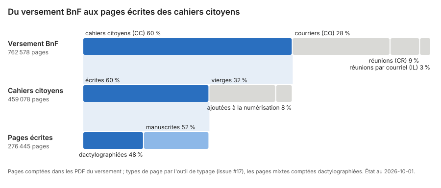

# Cascade : du versement BnF aux pages écrites

Ce que devient chaque page numérisée, niveau par niveau. Premier état du
corpus pour le travail d'archive : combien de pages le versement contient,
combien relèvent des cahiers citoyens, combien sont vraiment écrites.



```bash
uv run python -m typage <racine du versement>/B[nN][fF]_GDN_*_PDF/CC --sortie data/typage/pages.csv
uv run python -m cascade <racine du versement> --typage data/typage/pages.csv
```

La racine du versement contient les dossiers `BnF_GDN_XX_PDF` (un par
département, chacun avec `CC`, `CO`, `CR`, `IL`). Attention à la casse : celui
des Hautes-Pyrénées s'écrit `Bnf_GDN_65_PDF`. Le typage peut être découpé
par département et passé en parallèle : `--typage` accepte un dossier de CSV.

Sorties :

- `data/cascade/cascade.csv` (hors git) : pages et part de chaque segment,
  documents par catégorie ;
- `docs/cascade.svg` : la figure, versionnée. Elle ne contient que des
  comptes.

## Les niveaux

1. **Versement BnF** : toutes les pages des PDF, par catégorie de la BnF.
   Les inventaires et documents d'accompagnement (`A_lire/`) sont exclus.
2. **Cahiers citoyens** (CC) : les pages ajoutées à la numérisation
   (intercalaires, pages de garde) et les pages vierges sont écartées.
3. **Pages écrites** : dactylographiées ou manuscrites.

## Limites

- Seuls les CC sont typés. Les courriers (CO) sont dans le périmètre des
  doléances, mais leurs pages ne sont pas encore typées ; CR et IL sont hors
  périmètre.
- Le typage ne distingue pas les pages mixtes (dactylographiées complétées à
  la main) : elles sont comptées dactylographiées.
- Vérification à la main du typage sur 100 pages tirées au hasard : aucune
  page vierge manquée (0 sur 48) ; 2 inversions entre dactylographiée et
  manuscrite, 6 pages mixtes (issue #17).
