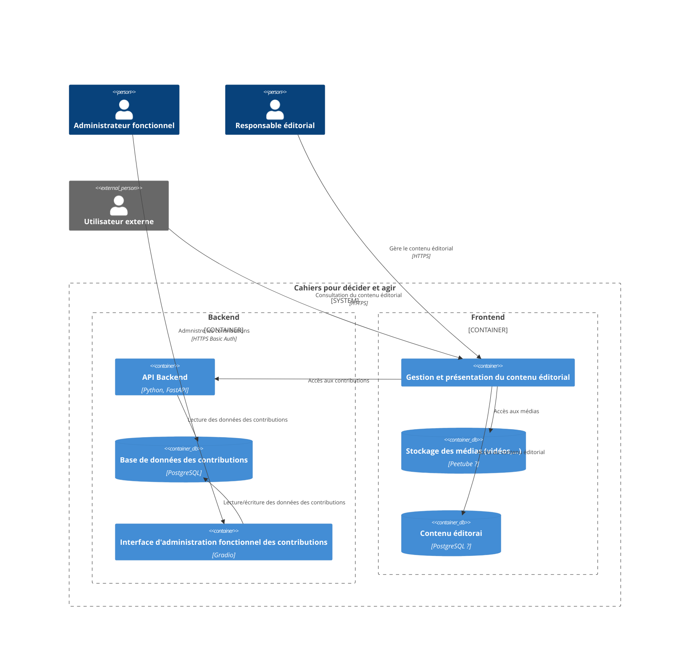

```mermaid
C4Context
  Person(Admin, "Administrateur fonctionnel")
  Person(RespEdit, "Responsable éditorial")
  Person_Ext(Utilisateur, "Utilisateur externe")
  System_Boundary(c1, "Cahiers pour décider et agir") {
    Container_Boundary(backend, "Backend") {
      Container(backend_api, "API Backend","Python, FastAPI")
      ContainerDb(db,"Base de données des contributions", "PostgreSQL")
      Container("backend_app", "Interface d'administration fonctionnel des contributions", "Gradio")
    }
    Container_Boundary(frontend, "Frontend") {
      Container(frontend_app, "Gestion et présentation du contenu éditorial")
      ContainerDb(frontend_stk, "Stockage des médias (vidéos,...)", "Peetube ?")
      ContainerDb(frontend_db, "Contenu éditorai", "PostgreSQL ?")
    }
  }

  Rel(backend_api, db, "Lecture des données des contributions")
  Rel(backend_app, db, "Lecture/écriture des données des contributions")
  Rel(frontend_app, backend_api, "Accès aux contributions")
  Rel(frontend_app, frontend_stk, "Accès aux médias")
  Rel(frontend_app, frontend_db, "Accès au contenu éditorial")
  Rel(RespEdit, frontend_app, "Gère le contenu éditorial", "HTTPS")
  Rel(Admin, backend_app, "Admnistre les contributions", "HTTPS Basic Auth")
  Rel(Utilisateur, frontend_app, "Consultation du contenu éditorial", "HTTPS")
```