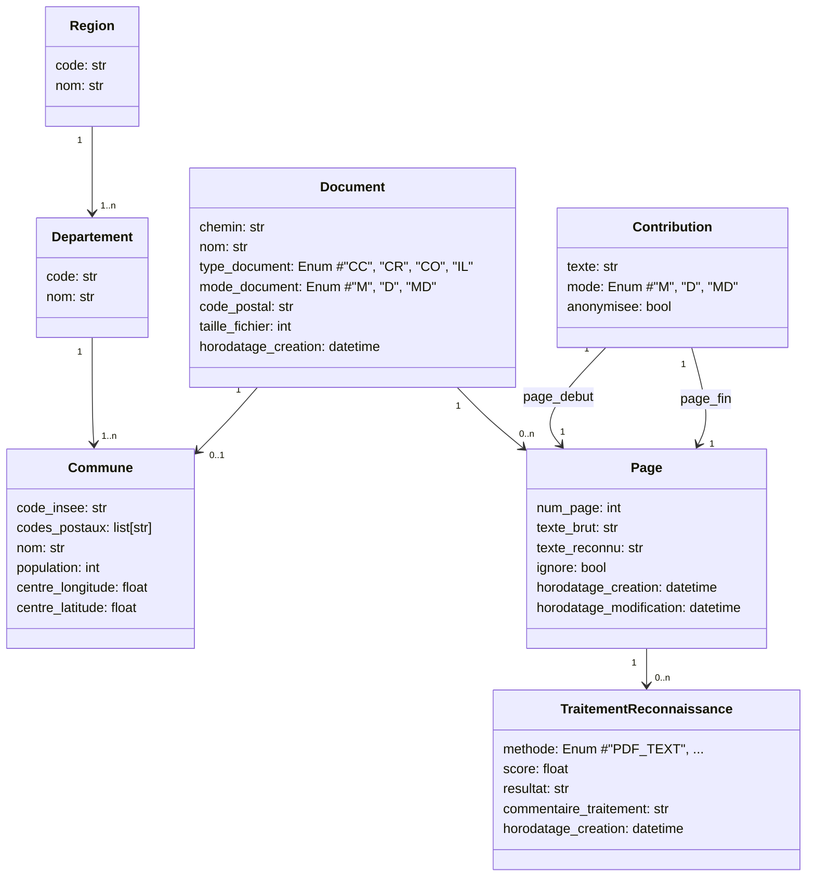

```mermaid
classDiagram
    class Region {
        code: str
        nom: str
    }

    class Departement {
        code: str
        nom: str
    }
    Region "1" --> "1..n" Departement

    class Commune {
      code_insee: str
      codes_postaux: list[str]
      nom: str
      population: int
      centre_longitude: float
      centre_latitude: float
    }
    Departement "1" --> "1..n" Commune

    class Document {
      chemin: str
      nom: str
      type_document: Enum #"CC", "CR", "CO", "IL"
      mode_document: Enum #"M", "D", "MD"
      code_postal: str
      taille_fichier: int
      horodatage_creation: datetime
    }
    Document "1" --> "0..1" Commune

    class Page {
      num_page: int
      texte_brut: str
      texte_reconnu: str
      ignore: bool
      horodatage_creation: datetime
      horodatage_modification: datetime
    }
    Document "1" --> "0..n" Page

    class TraitementReconnaissance {
      methode: Enum #"PDF_TEXT", ...
      score: float
      resultat: str
      commentaire_traitement: str
      horodatage_creation: datetime
    }
    Page "1" --> "0..n" TraitementReconnaissance

    class Contribution {
      texte: str
      mode: Enum #"M", "D", "MD"
      anonymisee: bool
    }
    Contribution "1" --> "1" Page: page_debut
    Contribution "1" --> "1" Page: page_fin

```